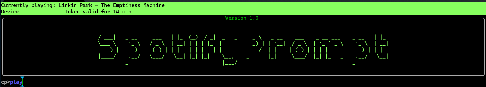

# SpotifyPromptClient

An advanced CLI client for Spotify, built on top of the PainKiller CommandPrompt framework.
Provides full terminal control over Spotify including AI-assisted artist enrichment, playlist building, tagging, backup, search, and much more.

Ask ChatGPT: https://chatgpt.com/g/g-680fb8d660748191a59e8aad386c727c-playlist-prompt-client



---

## Prerequisites

- **.NET 9.0 SDK** installed.
- A **Spotify Developer** account with a registered application:  
  [Register here](https://developer.spotify.com/dashboard/)
  
  You will need:
  - **Client ID**
  - **Redirect URI** (e.g., `http://localhost:5000/callback/`)

- Store your **Client ID** securely using the built-in Security module:

   ```bash
   secret --create "spotify_prompt"
   ```
- Ollama Service

  The Spotify Prompt Client uses AI with Ollama and Gemma3 to get related artists, since Spotify removed the Get Artist's Related Artists in their WebAPI. You can download this software here: https://ollama.com/download it is a lightweight service running in the background.
  You CAN USE this client without it, but some of it´s functionality regarding building playlists will not work.
  
---

## Installation

1. **Clone** the repository:

   ```bash
   git clone https://github.com/your-org/SpotifyPromptClient.git
   cd SpotifyPromptClient
   ```

2. **Configure** your application settings (`CommandPromptConfiguration.yaml`):

   ```yaml
   spotify:
     redirectUri: "http://localhost:5000/callback/"
     refreshMarginInMinutes: 10
     scopes:
       - user-read-playback-state
       - user-modify-playback-state
       - playlist-read-private
       - playlist-modify-public
       - playlist-modify-private
   ```

3. **Build** the project:

   ```bash
   dotnet build
   ```

4. **Run** the CommandPrompt host:

   ```bash
   dotnet run --project src/PainKiller.CommandPrompt.Host
   ```

---

## Available Commands

| Command          | Description                                                                         |
|------------------|-------------------------------------------------------------------------------------|
| `login`          | Authenticate with your Spotify account.                                             |
| `play`           | Play current track, a specific track by index, or all selected tracks.              |
| `pause`          | Pause the current playback.                                                         |
| `next`           | Skip to the next track.                                                              |
| `previous`       | Go back to the previous track.                                                       |
| `shuffle`        | Toggle shuffle mode.                                                                |
| `device [name]`  | List devices or switch playback to a specified device.                              |
| `volume [value]` | Set or display the current volume.                                                   |
| `mute`           | Mute volume (sets volume to 0).                                                      |
| `unmute [--volume value]` | Unmute and optionally set volume.                                           |
| `queue [index|selected]` | View or modify the playback queue.                                           |
| `latest`         | Show latest played tracks during session, optionally create playlist from history.  |
| `list [--update|--compare]` | View, update, or compare playlists.                                       |
| `selected [--clear]` | Show or clear selected tracks, albums, or artists.                              |
| `track [filter]` | Select and filter saved tracks.                                                      |
| `album [filter]` | Select and filter saved albums.                                                      |
| `artist [filter]`| Select and filter saved artists, with optional AI enrichment.                        |
| `user`           | Display Spotify user profile information.                                           |
| `tags`           | Add or repair tags for artists, albums, playlists, or tracks.                       |
| `search [type] "query"` | Search for tracks, albums, artists, or playlists.                          |
| `backup`         | Backup all stored Spotify data locally.                                              |
| `build`          | Build custom playlists using templates and AI.                                       |
| `append`         | Handle append select mode, practical to build content for your playlist.             |
| `ai`             | Use AI to find related artists based on existing data.                               |
| `warped`         | View your top tracks or artists statistics ("Spotify Wrapped" style).                |

---

## Workflow Example

1. **Login** to Spotify:

   ```bash
   login
   ```

2. **Update and list your playlists**:

   ```bash
   list --update
   list
   ```

3. **Control playback**:

   ```bash
   play
   next
   pause
   ```

4. **Search tracks and build playlists**:

   ```bash
   append
   search track --artist queen
   build
   ```

5. **Use AI enrichment**:

   ```bash
   ai
   artist --ai
   ```

---

## Notes

- **Session selections**: You can accumulate selected tracks, albums, and artists across commands (search, album, artist) and operate on them, just turn on append if you want to accumulate your selection that could be use when building a playlist with `build` command.
- **AI Integration**: Integrates with a local or remote AI server (Ollama) for artist enrichment and tagging.
- **Backup**: Important Spotify data is persisted and can be backed up at any time.
- **Automatic Token Handling**: No manual refresh needed; tokens are refreshed automatically when needed.

---

## Troubleshooting

- Ensure the **Redirect URI** registered in Spotify Dashboard matches your configuration exactly.
- If the access token expires and refresh fails, run `login` again.
- Update your Spotify application scopes if you encounter permission issues.

---

**Enjoy controlling Spotify directly from your terminal!**

[Learn more about Spotify Web API](https://developer.spotify.com/documentation/web-api)

